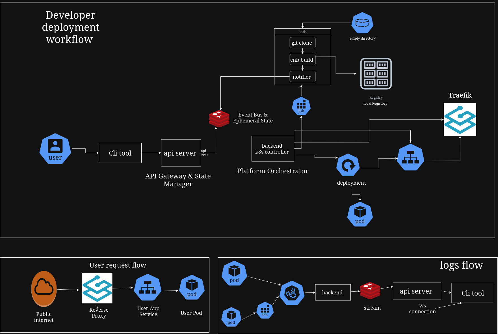

# ForgePaaS 🚀

A self-hosted, open-source **Platform-as-a-Service (PaaS)** built on Kubernetes.

ForgePaaS allows developers to **build, deploy, run, and manage applications** using a CLI and API.
The focus is **developer simplicity first**, scale later.

---

## 🎯 Goals

* Simple developer experience
* Fully self-hosted
* Kubernetes-native runtime
* CLI + API driven workflows
* Minimal, understandable architecture

---

## 👥 Who is ForgePaaS for?

* DevOps engineers learning platform internals
* Kubernetes-native backend developers
* Students building real infrastructure projects
* Teams wanting a simple self-hosted PaaS

---

## 🧱 Architecture (Version 1)

> 📐 **Architecture Diagram**
> 

```
[ Developer ]
      |
      v
[ Forge CLI ]
      |
      v
[ API Server ]
      |
      v
[ Redis (State + Queue) ]
      |
      v
[ Build Worker (CNB) ]
      |
      v
[ Local Docker Registry ]
      |
      v
[ Kubernetes Controller ]
      |
      v
[ Kubernetes Pods ]
      |
      v
[ Reverse Proxy (Ingress) ]
```

---

## 🧩 Core Components

### API Server

**Role:** Central control plane for the platform.

**Responsibilities:**

* Accept CLI requests (deploy, status, logs, delete)
* Store application metadata in Redis
* Enqueue build and deploy jobs
* Coordinate internal services

---

### Redis (State + Queue)

**Role:** In-memory store and job queue.

**Used for:**

* Application metadata
* Build and deployment queues
* Temporary platform state

---

### Build Worker (Cloud Native Buildpacks)

**Role:** Builds OCI container images from source code.

**Details:**

* Pulls source repository
* Runs CNB lifecycle (no Docker socket)
* Produces OCI image
* Pushes image to local registry

---

### Local Docker Registry

**Role:** Internal container image storage.

**Why local:**

* No external dependency
* Fast Kubernetes pulls
* Full control over images

---

### Kubernetes Controller

**Role:** Converts platform intent into Kubernetes resources.

**Responsibilities:**

* Create or update Deployments
* Create Services
* Apply resource limits
* Handle redeployments
* Handle delete workflows

---

### Reverse Proxy (Ingress)

**Role:** Routes external traffic to application pods.

**Features:**

* Subdomain-based routing
* Dynamic configuration
* Single entry point

---

### CLI Tool

**Role:** Developer-facing interface.

**Version 1 Commands:**

```bash
forge deploy
forge status
forge apps
forge logs
forge delete [--force]
```

**Responsibilities:**

* Trigger deployments
* Show application status
* List applications
* Stream logs
* Delete applications

---

## 🔁 Deployment Flow

```text
forge deploy
   ↓
API Server receives request
   ↓
Redis queues build job
   ↓
Build Worker runs CNB
   ↓
Image pushed to local registry
   ↓
Kubernetes Controller deploys app
   ↓
Reverse Proxy exposes app
```

---

## ⚠️ Failure Handling (v1)

* Build failures do not affect running apps
* Failed builds are retriable
* Partial deployments are cleaned automatically
* Force delete can recover stuck resources

---

## 🚀 Getting Started (Startup Script)

### Prerequisites

* Linux host
* Kubernetes cluster (k3s / kind / kubeadm)
* kubectl configured
* Docker installed

### One-Command Startup

```bash
curl -fsSL https://raw.githubusercontent.com/nXtCyberNet/ForgePaas/main/scripts/start.sh | bash
```

### What the startup script does

* Creates `forge-system` namespace
* Deploys Redis
* Deploys local Docker registry
* Deploys API server
* Deploys build worker
* Deploys controller
* Deploys ingress / reverse proxy

After completion, ForgePaaS control plane is ready.

---

## 🧱 Namespace Isolation Model

ForgePaaS uses **namespace-level isolation**.

### How it works

* Platform components run in `forge-system`
* One Kubernetes namespace per application

Example:

```bash
forge deploy myapp
```

Creates:

```text
Namespace: forge-myapp
```

### Benefits

* Strong resource isolation
* Clear ownership boundaries
* Easy cleanup
* Native Kubernetes security model

---

## 🗑️ Delete, Cleanup & Teardown

ForgePaaS supports **two deletion modes** depending on how safely or quickly you want to tear down an app.

### Graceful Delete (default)

```bash
forge delete <app-name>
```

What happens:

* Scales Deployment to zero
* Waits for pod termination grace period
* Drains connections via Ingress
* Deletes Deployment and Service
* Deletes application namespace

Use this for **normal production-safe shutdowns**.

---

### Force Delete (immediate)

```bash
forge delete <app-name> --force
```

What happens:

* Immediately deletes Deployment
* Skips grace period
* Force-deletes pods
* Deletes Service and Ingress
* Deletes application namespace

⚠️ **WARNING**
Force delete may drop in-flight requests.

---

### Full Platform Cleanup

```bash
scripts/cleanup.sh
```

This removes:

* All ForgePaaS namespaces
* Redis data
* Local registry
* Controller resources

Use this for complete teardown or reinstallation.

---

## 📦 Version 1 Scope (MVP)

### Included

* Application deployment
* CNB-based image builds
* Local Docker registry
* Kubernetes runtime
* Dynamic routing
* CLI deploy and status
* Basic log streaming
* Namespace-based isolation
* Graceful & force deletion

### Not Included

* Authentication
* Multi-tenant billing
* Autoscaling
* Persistent storage

---

## 🔐 Version 2 (Planned)

### Security

* Token-based CLI authentication
* API authentication middleware
* Role-based access control
* Namespace isolation per user

### Observability

* Live log streaming
* Application metrics
* Health checks

### Platform Features

* Automatic HTTPS
* Autoscaling
* Rollbacks
* Secrets management

---

## 🛡️ Security Philosophy

* Least privilege by default
* No Docker socket exposure
* Resource limits on all pods
* Internal-only control plane

---

## 🧠 Design Principles

* Simple over complex
* One responsibility per service
* Kubernetes as final runtime
* Explicit and observable flows
* Easy to debug and reason about

---

## 🚧 Project Status

**Version:** `0.1`
**State:** Active development

---

## 🤝 Contributing

ForgePaaS is built for learning and real-world experimentation.
Contributions, reviews, and ideas are welcome.
